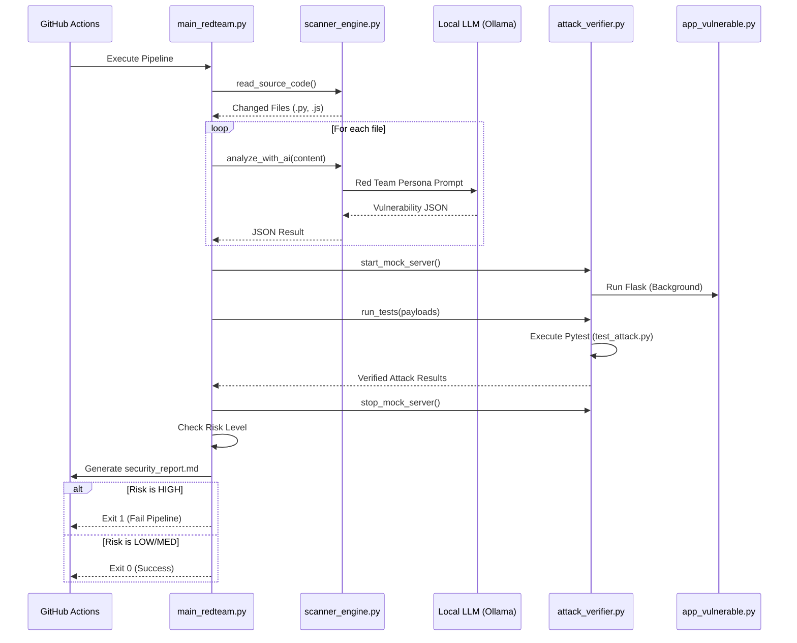

# AI-Red Teamer: System Architecture

โครงสร้างสถาปัตยกรรมของระบบ AI-Red Teamer ที่ใช้ในโปรเจคเพื่อตรวจสอบช่องโหว่ความปลอดภัยอัตโนมัติ

## 1. ผังภาพรวมของระบบ (System Overview)

ระบบทำงานบนพื้นฐานของ CI/CD Orchestration โดยมีการดึงพลังของ Large Language Model (LLM) อย่าง Ollama (llama3.2) มาช่วยในการวิเคราะห์โค้ดและสร้าง Payload สำหรับทดสอบ

```mermaid
graph TD
    A[GitHub Repository] -->|Push/PR| B[GitHub Actions]
    subgraph "CI/CD Pipeline"
        B --> C[Orchestrator: main_redteam.py]
        C --> D[Scanner: scanner_engine.py]
        C --> E[Verifier: attack_verifier.py]
    end
    
    subgraph "AI Logic"
        D -->|Send Code| F[Ollama (llama3.2)]
        F -->|JSON Response| D
    end
    
    subgraph "Verification Logic"
        E -->|Start| G[Mock Server: app_vulnerable.py]
        E -->|Run Payload| H[Pytest: test_attack.py]
        H -->|HTTP Request| G
        G -->|Response| H
    end
    
    H -->|Exploit Result| E
    E -->|Summary| I[Security Report]
    I -->|Exit Code 0/1| B
```

## 2. ขั้นตอนการทำงาน (Sequence Diagram)



## 3. รายละเอียดส่วนประกอบ (Component Details)

### 3.1 GitHub Actions Orchestrator
ทำหน้าที่เป็นช่องทางการเข้า (Entry Point) ของระบบ คอยสั่งการให้ระบบเริ่มทำงานเมื่อมีการเปลี่ยนแปลงโค้ดใน [main](file:///d:/project/AI-Red_Teamer/main_redteam.py#6-66) branch

### 3.2 AI Scanner Engine ([scanner_engine.py](file:///d:/project/AI-Red_Teamer/scanner_engine.py))
- **Git Integration**: ใช้ `git show` เพื่อระบุตำแหน่งโค้ดที่มีการแก้ไขล่าสุด
- **LLM Connectivity**: เชื่อมต่อกับ Ollama ผ่าน OpenAI-compatible API
- **Persona**: กำหนดบุคลิกของ AI เป็น "หัวหน้าทีม Red Team" เพื่อเน้นการหาช่องโหว่ OWASP Top 10

### 3.3 Attack & Verify Module ([attack_verifier.py](file:///d:/project/AI-Red_Teamer/attack_verifier.py))
- **Automated Exploitation**: นำ Payload ที่ AI คิดมาลองยิงใส่เป้าหมายจริง
- **False Positive Reduction**: หาก AI รายงานว่ามีช่องโหว่แต่ Verifier ยิงไม่เข้า จะทำให้ระดับความรุนแรงถูกตรวจสอบซ้ำได้
- **Reporting**: สรุปผลความปลอดภัยในรูปแบบ Markdown (`security_report.md`)

### 3.4 Mock Engine ([app_vulnerable.py](file:///d:/project/AI-Red_Teamer/app_vulnerable.py))
ทำหน้าที่เป็น "Sandboxed Target" ที่มีช่องโหว่แบบจงใจ เพื่อให้ระบบรันการโจมตีได้อย่างปลอดภัยในขั้นตอนการทดสอบ

## 4. เทคโนโลยีที่ใช้ (Tech Stack)

- **Language**: Python 3.11+
- **LLM**: Ollama (llama3.2)
- **Testing**: Pytest
- **Orchestration**: GitHub Actions
- **Web**: Flask (for Mock Server)
- **Communication**: requests, JSON
